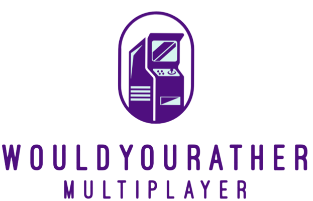

<!-- Improved compatibility of back to top link: See: https://github.com/othneildrew/Best-README-Template/pull/73 -->
<a name="readme-top"></a>
<!--
*** Thanks for checking out the Best-README-Template. If you have a suggestion
*** that would make this better, please fork the repo and create a pull request
*** or simply open an issue with the tag "enhancement".
*** Don't forget to give the project a star!
*** Thanks again! Now go create something AMAZING! :D
-->

<!-- PROJECT SHIELDS -->
<!--
*** I'm using markdown "reference style" links for readability.
*** Reference links are enclosed in brackets [ ] instead of parentheses ( ).
*** See the bottom of this document for the declaration of the reference variables
*** for contributors-url, forks-url, etc. This is an optional, concise syntax you may use.
*** https://www.markdownguide.org/basic-syntax/#reference-style-links
-->
[![Contributors][contributors-shield]][contributors-url]
[![Forks][forks-shield]][forks-url]
[![Stargazers][stars-shield]][stars-url]
[![Issues][issues-shield]][issues-url]
[![MIT License][license-shield]][license-url]
[![LinkedIn][linkedin-shield]][linkedin-url]

<!-- PROJECT LOGO -->
<br />
<div align="center">
  <a href="https://github.com/RayaneB75/multiplayer-wyr">
     
  </a>

<h3 align="center">Would You Rather - Multiplayer online version</h3>

  <p align="center">
    This web app aims to be a multiplayer online version of the game "Would You Rather". This is not a real time game, but a game where the user id is used to identify the player. The game is played in rounds, and the score is displayed in real time on a dashboard.
    <br />
    <a href="https://github.com/RayaneB75/multiplayer-wyr/tree/main/docs"><strong>Explore the docs »</strong></a>
    <br />
    <br />
    <a href="#about-the-project">View Demo</a>
    ·
    <a href="https://github.com/RayaneB75/multiplayer-wyr/issues">Report Bug</a>
    ·
    <a href="https://github.com/RayaneB75/multiplayer-wyr/issues">Request Feature</a>
  </p>
</div>

<!-- TABLE OF CONTENTS -->
<details>
  <summary>Table of Contents</summary>
  <ol>
    <li>
      <a href="#about-the-project">About The Project</a>
      <ul>
        <li><a href="#built-with">Built With</a></li>
      </ul>
    </li>
    <li>
      <a href="#getting-started">Getting Started</a>
      <ul>
        <li><a href="#prerequisites">Prerequisites</a></li>
        <li><a href="#installation">Installation</a></li>
      </ul>
    </li>
    <li><a href="#usage">Usage</a></li>
    <li><a href="#roadmap">Roadmap</a></li>
    <li><a href="#contributing">Contributing</a></li>
    <li><a href="#license">License</a></li>
    <li><a href="#contact">Contact</a></li>
    <li><a href="#acknowledgments">Acknowledgments</a></li>
  </ol>
</details>

<!-- ABOUT THE PROJECT -->
## About The Project

[![Product Name Screen Shot][product-screenshot]](https://example.com)

The idea behind this web app was to make a small mini-game that could be played during a party. As part of the integration week at our engineering school, [IMT Atlantique](https://imt-atlantique.fr/en) (Brest campus), we had to organize a party for the new students. We wanted to make a game that could be played during the party, and that would allow the students to get to know each other better. We decided to make a "Would You Rather" game, where the students would have to find partners to answer questions (2 per partner), and the scores (number of questions answered) would be displayed in real time on a screen (dashboard).

<p align="right">(<a href="#readme-top">back to top</a>)</p>

### Made with <span style="color: #e25555;">&#9829;</span> with

* [![Flutter][Flutter.svg]][Flutter-url]
* [![Python][Python.svg]][Python-url]
* [![Flask][Flask.svg]][Flask-url]
* [![PHP][PHP.svg]][PHP-url]
* [![MySQL][MySQL.svg]][MySQL-url]

<p align="right">(<a href="#readme-top">back to top</a>)</p>

<!-- GETTING STARTED -->
## Getting Started

This is an example of how you may give instructions on setting up your project locally.
To get a local copy up and running follow these simple example steps.

### Prerequisites

This is an example of how to list things you need to use the software and how to install them.

* npm

  ```sh
  npm install npm@latest -g
  ```

### Installation

1. Get a free API Key at [https://example.com](https://example.com)
2. Clone the repo

   ```sh
   git clone https://github.com/RayaneB75/multiplayer-wyr.git
   ```

3. Install NPM packages

   ```sh
   npm install
   ```

4. Enter your API in `config.js`

   ```js
   const API_KEY = 'ENTER YOUR API';
   ```

<p align="right">(<a href="#readme-top">back to top</a>)</p>

<!-- USAGE EXAMPLES -->
## Usage

Use this space to show useful examples of how a project can be used. Additional screenshots, code examples and demos work well in this space. You may also link to more resources.

_For more examples, please refer to the [Documentation](https://example.com)_

<p align="right">(<a href="#readme-top">back to top</a>)</p>

<!-- ROADMAP -->
## Roadmap

* [ ] Feature 1
* [ ] Feature 2
* [ ] Feature 3
  * [ ] Nested Feature

See the [open issues](https://github.com/RayaneB75/multiplayer-wyr/issues) for a full list of proposed features (and known issues).

<p align="right">(<a href="#readme-top">back to top</a>)</p>

<!-- CONTRIBUTING -->
## Contributing

Contributions are what make the open source community such an amazing place to learn, inspire, and create. Any contributions you make are **greatly appreciated**.

If you have a suggestion that would make this better, please fork the repo and create a pull request. You can also simply open an issue with the tag "enhancement".
Don't forget to give the project a star! Thanks again!

1. Fork the Project
2. Create your Feature Branch (`git checkout -b feature/AmazingFeature`)
3. Commit your Changes (`git commit -m 'Add some AmazingFeature'`)
4. Push to the Branch (`git push origin feature/AmazingFeature`)
5. Open a Pull Request

<p align="right">(<a href="#readme-top">back to top</a>)</p>

<!-- LICENSE -->
## License

Distributed under the MIT License. See `LICENSE.txt` for more information.

<p align="right">(<a href="#readme-top">back to top</a>)</p>

<!-- CONTACT -->
## Contact

* Rayane BELKHIR - [@RayaneB75](mailto:pro@rayanebelkhir.fr)
* Louis RAVAUX - [@louisravaux](mailto:louis.ravaux@imt-atlantique.net)

Project Link: [https://github.com/RayaneB75/multiplayer-wyr](https://github.com/RayaneB75/multiplayer-wyr)

<p align="right">(<a href="#readme-top">back to top</a>)</p>

<!-- ACKNOWLEDGMENTS -->
## Acknowledgments

* []()
* []()
* []()

<p align="right">(<a href="#readme-top">back to top</a>)</p>

<!-- MARKDOWN LINKS & IMAGES -->
<!-- https://www.markdownguide.org/basic-syntax/#reference-style-links -->
[contributors-shield]: https://img.shields.io/github/contributors/RayaneB75/multiplayer-wyr.svg?style=for-the-badge
[contributors-url]: https://github.com/RayaneB75/multiplayer-wyr/graphs/contributors
[forks-shield]: https://img.shields.io/github/forks/RayaneB75/multiplayer-wyr.svg?style=for-the-badge
[forks-url]: https://github.com/RayaneB75/multiplayer-wyr/network/members
[stars-shield]: https://img.shields.io/github/stars/RayaneB75/multiplayer-wyr.svg?style=for-the-badge
[stars-url]: https://github.com/RayaneB75/multiplayer-wyr/stargazers
[issues-shield]: https://img.shields.io/github/issues/RayaneB75/multiplayer-wyr.svg?style=for-the-badge
[issues-url]: https://github.com/RayaneB75/multiplayer-wyr/issues
[license-shield]: https://img.shields.io/github/license/RayaneB75/multiplayer-wyr.svg?style=for-the-badge
[license-url]: https://github.com/RayaneB75/multiplayer-wyr/blob/master/LICENSE
[linkedin-shield]: https://img.shields.io/badge/-LinkedIn-black.svg?style=for-the-badge&logo=linkedin&colorB=555
[linkedin-url]: https://linkedin.com/in/rayane-belkhir
[product-screenshot]: images/screenshot.png
[Flutter.svg]: https://img.shields.io/badge/flutter-000000?style=for-the-badge&logo=flutter&logoColor=dark
[Flutter-url]: https://flutter.dev/
[Python.svg]: https://img.shields.io/badge/python-000000?style=for-the-badge&logo=python&logoColor=dark
[Python-url]: https://www.python.org/
[Flask.svg]: https://img.shields.io/badge/flask-000000?style=for-the-badge&logo=flask&logoColor=dark
[Flask-url]: https://flask.palletsprojects.com/en/3.0.x/
[PHP.svg]: https://img.shields.io/badge/php-000000?style=for-the-badge&logo=php&logoColor=dark
[PHP-url]: https://www.php.net/
[MySQL.svg]: https://img.shields.io/badge/mysql-000000?style=for-the-badge&logo=mysql&logoColor=dark
[MySQL-url]: https://www.mysql.com/en/
